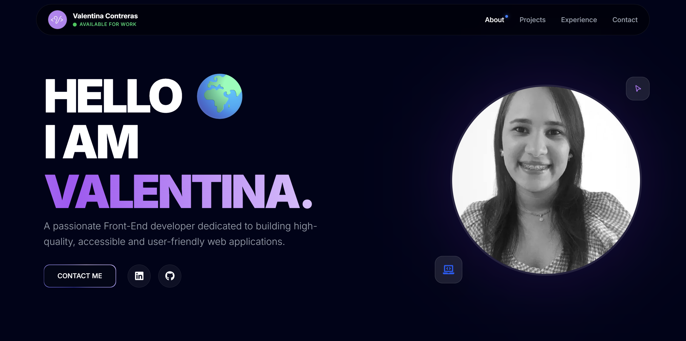

# 🚀 My Portfolio

A modern, dynamic, and responsive portfolio built with the latest web technologies.



## ✨ Features

- **Premium Design**: Elegant interface with smooth animations and modern visual effects.
- **Micro-animations**: Intensive use of `framer-motion` for an interactive user experience.
- **Tech Stack**: Optimized with Next.js and Tailwind CSS.
- **Sections**: Hero, Profile, Tech Stack, Experience, and Projects.

## 🤖 AI-Assisted Development

This portfolio is a testament to the **power of human-AI collaboration**.

It was developed using advanced AI models (Antigravity/Gemini) that assisted in:

- **Component Architecture**: Logical and modular structuring of the application.
- **Animation Logic**: Implementation of complex effects with Framer Motion.
- **Style Optimization**: Refined design using Tailwind CSS.
- **Code Quality**: Configuration of linting and formatting tools for easy maintenance.

## 🛠️ Technologies

- [Next.js](https://nextjs.org/)
- [React](https://reactjs.org/)
- [Tailwind CSS](https://tailwindcss.com/)
- [Framer Motion](https://www.framer.com/motion/)
- [Lucide Icons](https://lucide.dev/)
- [React Icons](https://react-icons.github.io/react-icons/)

## 🚀 Installation and Usage

1. **Clone the repository:**

   ```bash
   git clone <repository-url>
   ```

2. **Install dependencies:**

   ```bash
   yarn install
   ```

3. **Run in development:**

   ```bash
   yarn dev
   ```

4. **Format code:**

   ```bash
   yarn format
   ```

5. **Build for production:**
   ```bash
   yarn build
   ```

---

Made with ❤️ and 🤖 by Valentina Contreras
